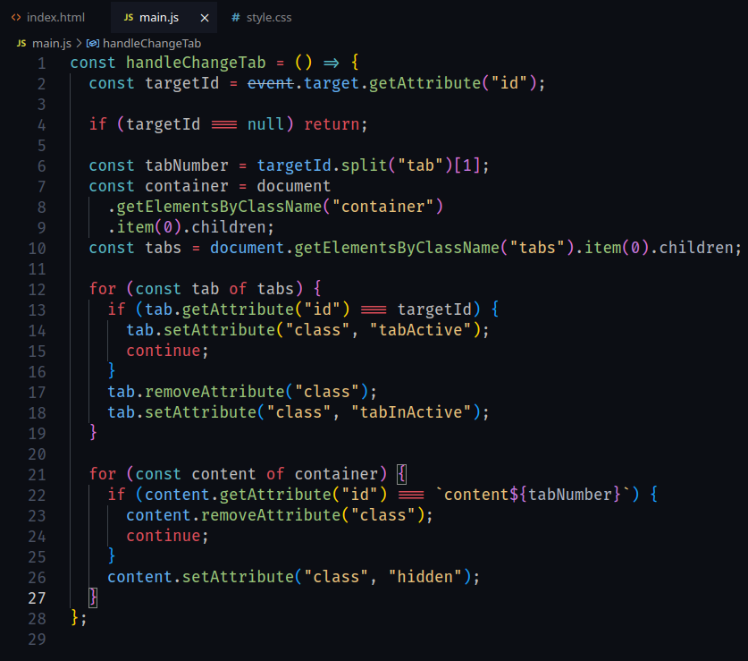

# [Vasuki Dark Theme](https://github.com/pygaurav/vasuki-dark-vscode-theme)

A dark theme for VS Code which add sweet experience and feel into your coding.

## Installation

Press `ctrl/command + shift + p` to launch the command palette, then run:
```
ext install Ittwist.vasuki-dark-theme
```

## Screenshots




## Requirements

* Visual Studio Code (http://code.visualstudio.com/)
* Add Fira Code Font (Optional)


## License

Apache 2.0, for further details, please see [LICENSE](LICENSE) file